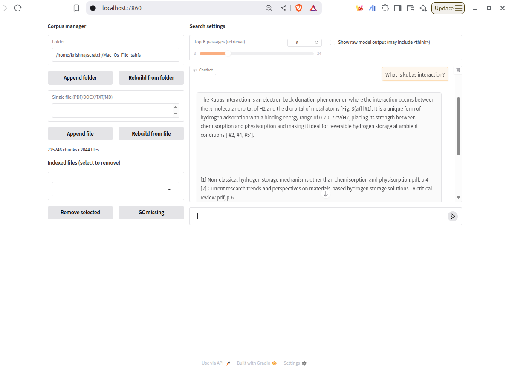
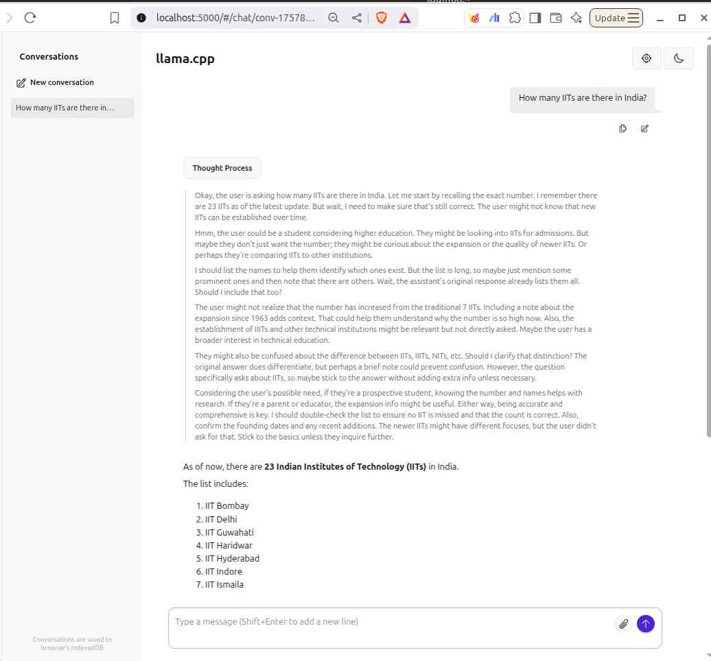

# RAG on llama.cpp (IIT Delhi)

As researchers, reading research articles is an everyday task. Overtime, we accumulated thousands of research articles and a year later we remember reading about XYZ in some paper that exist somewhere in 'Research_Articles' directory. What if you could ask questions to a chat model and get answers with precise citations (filename, page number, figure number etc)? Wouldn't that make literature recall instant and let you focus on insight rather than search—so you can cite confidently, reproduce analyses, and pull the exact figure or paragraph you need in seconds?

Chat with your **own research papers** using a local RAG pipeline.
Back end: two `llama.cpp` servers (chat + embeddings) running on IIT-D HPC, tunneled to your laptop.  
Front end: `rag.py` (FAISS + BM25) with a Gradio UI.

**It's like using Notebooklm except that you're not limited by the number of files are file size.**

> Full setup, HPC commands, and troubleshooting: [docs/Instructions.md](docs/Instructions.md)
> 
> llama is inference runner (model manager): https://github.com/ggml-org/llama.cpp
>
> Two known issues: Sometimes chat model doesn't respond. This could be the chat model I used. Chain of thought (raw model output) not working; meaning you cannot see what chat model is thinking.

## Preview
### RAG web UI running at localhost:7860

  
   
  <em>Gradio UI: ask questions, see sources, manage your corpus.</em>

### Chat model runninng at localhost:5000

  
   
  <em>Chat server smoke test via /v1/chat/completions.</em>

Credits: Assisted by ChatGPT and Perplexity.
